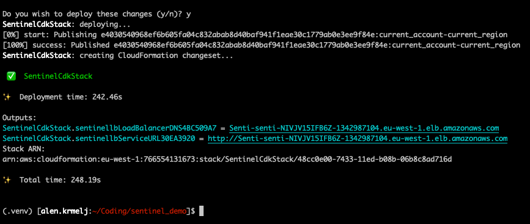
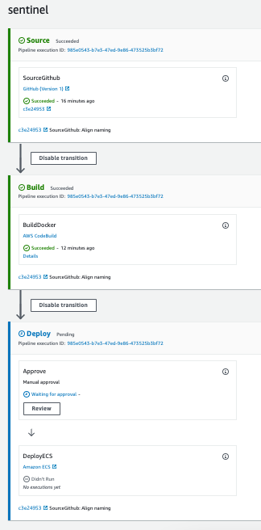

# Prerequirements:

- Python 3.8+
- Node 18.x
- CDK 2.x
- awscli 2.x

Configure your aws client, choose region and enter AWS key and secret

```
$ aws configure
```

Edit `config.py.dist` and copy it to `config.py`!

# Installation:

In cloned directory:

```
$ python3 -m venv .venv
$ source .venv/bin/activate
$ pip install -r requirements.txt
```

# Running:

It's as simple as:

```
$ cdk bootstrap  # Only if you never ran CDK on AWS account yet
$ cdk synth  # Verify cf template gets generated and no errors
$ cdk deploy  # This will deploy whole thing
```

Deploy should look like this, note the URL for your microservice!



# Deploy on repo change:

Code will hook up to main branch of github and listen to merges.
Once merge happens it will run pipeline in these stages:

- Checkout source
- Build docker image
- Wait for approval (You need to click on console to approve deploy)
- Deploy to ECS Fargate

Here is how it looks in AWS console:



# Troubleshooting:

If you recieve "Internal error" during Cloudformation forming, be sure to review your github token and privileges. It's an unpleasent error you get from AWS and hard to debug just from it...

# Additional notes:

This is PoC that suffices for interview purposes. There are several issues with this code though, and is not production ready.

To name just a few:
- its good practice to have at least /health endpoint implemented in microservice. here I added index, so it's returning 200 response code for service to be considered healthy and included in loadbalancer
- credentials should be stored in credentials manager
- code could be split into two parts, one that sets up whole infra and pipeline separate
- buildspec in infrastructure code is a no-no, but convenient in this case